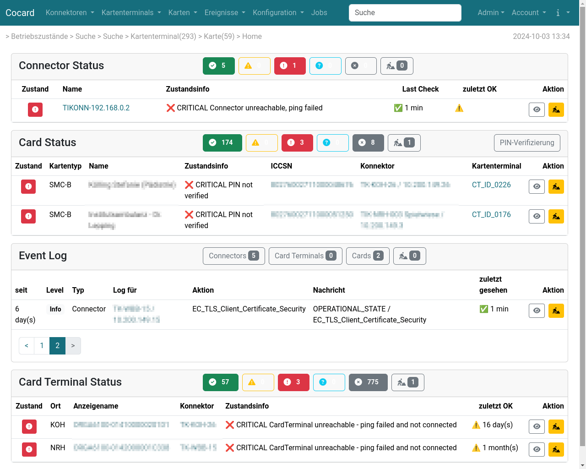
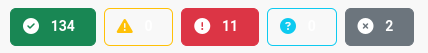
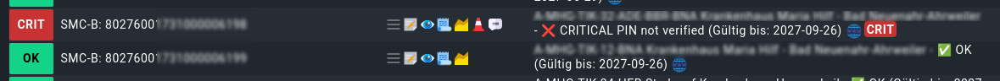

= Cocard

Cocard - ein Akronym für _Connectors and Cards_ - dient der Überwachung und
Administration der lokalen Telematik-Infrastruktur. In größeren Umgebungen wie 
einem Verbund von mehreren Kliniken sind oft viele hundert Kartenterminals im 
Einsatz, die ausgerollt und überwacht werden müssen. Und manchmal scheitert der 
Einsatz der Telematik einfach nur daran, dass die Steckdosenleiste belegt war, 
ein Kollege das Netzteil das Kartenterminals gezogen und nach dem Laden des 
Smartphones oder Tablets das Netzteil nicht wieder eingesteckt hat.

Für die Identifikation der Betriebsstätte sind Zertifikate notwendig (SMC-B), 
die ein Ablaufdatum haben. Jedes Kartenterminal hat ebenfalls ein Zertifikat 
für die Absicherung der Kommunikation (SMC-KT). Das sind in den oben genannten 
Klinikverbünden hunderte von Ablaufdaten, die man im Auge behalten muss.

Cocard inventarisiert und überwacht Kartenterminals und Karten (SMC-B, SMC-KT) 
weitestgehend automatisiert. Im einfachsten Falle (ohne Client-Authentifikation 
am Konnektor; ein einheitlicher Kontext, mit dem man alle Systeme abfragen 
kann) genügt die Konfiguration des Konnektors mit IP-Adresse und einem 
Standard-Kontext. Den Rest erledigt Cocard.

Das Ergebnis stellt Cocard in einem Dashboard zusammen:

In den Abschnitten Connector, Card und Card Terminal werden alle Einträge mit 
WARNING (gelb) und CRITICAL (rot) angezeigt. Cocard folgt hier der der 
Klassifikation von Nagios, ergänzt um einen Zustand für nicht Betrieb/nicht 
konfiguriert: 

* 0 == OK (grün)
* 1 == WARNING (gelb)
* 2 == CRITICAL (rot)
* 3 == UNKNOWN (helblau, in der Regel Konfigurationsfehler)
* -1 = NOTHING (nicht in Betrieb oder nicht vollständig konfiguriert)

Ein Klick auf einen der Buttons ändert die Ansicht im jeweiligen Abschnitt und 
zeigt dann die Einträge mit dem gewählten Status an:

Buttons, die nur umrandet sind haben keine Einträge zum jeweiligen Status.

Der Abschnitt Event Log zeigt die ausgewählte aktuelle 
Betriebszustandsmeldungen des Konnektors (`OPERATIONAL_STATE`) und SOAP-Fehlermeldungen, die bei der Abfrage entstehen (z.B. _Kartenterminal ist dem Mandanten nicht zugeordnet_, _Für den Mandanten ist der Arbeitsplatz nicht dem Clientsystem zugeordnet_). 

== Integration in CheckMK

Cocard verfügt über eine einfache Integration in https://docs.checkmk.com/latest/de/[CheckMK]: über einen sogenannten https://docs.checkmk.com/latest/de/localchecks.html[Local Check] lassen sich Konnektoren, Kartenterminals und 
Karten sehr einfach in CheckMK einbinden. Hier ein Beispiel für SMC-B-Karten:

== Wie funktioniert Cocard?

Cocard nutzt die von der Gematik definierten SOAP-Schnittstellen am Konnektor, 
insbesondere `GetResourceInformation`, `GetCardTerminals`, `GetCards`, 
`GetPinStatus` und `ReadCardCertificate`. Über SOAP sollte Cocard mit jedem 
Konnektor kommunizieren können, im Einsatz ist Cocard bisher mit der KoCoBox.

Eine entscheidende Rolle spielt der Kontext aus Mandant, ClientSystemID und 
Arbeitsplatz. Dieses Triple hat die Funktion eines Filters. Cocard sieht nur 
Kartenterminals und Karten, die am Konnektor zu diesem Kontext freigeschaltet 
sind.

Beim Konnektor und bei einer SMC-B-Karte kann man parallel mehrere Kontexte 
hinterlegen, z.B. für die Pin-Verifikation einer SMC-B-Karte gegen mehrere 
Mandanten oder beim Einsatz von mehreren Primärsystemen mit der selben 
SMC-B-Karte.

== Installation

Cocard steht als https://github.com/swobspace/cocard/pkgs/container/cocard[Container] für die Nutzung mit Docker/Podman bereit - optimiert für den 
Einsatz mit Podman und Quadlets. Neben dem Cocard-Container wird noch 
PostgreSQL und Redis benötigt (ebenfalls als Container).

NOTE: Die Dokumentation für die Installation ist noch nicht fertig. Es fehlt 
noch ein `docker-compose.yml`. Stay tuned. Bei Interesse bitte eine kurze Info 
in https://github.com/swobspace/cocard/discussions[Discussions] hinterlassen.

== Fragen, Bugs und andere Sachen ...

Fragen zu Cocard bitte in https://github.com/swobspace/cocard/discussions[Discussions] stellen. https://github.com/swobspace/cocard/issues[Issues] 
bleibt den echten Bugs vorbehalten. Feature-Requests bitte ebenfalls zuerst in 
Diskussions einstellen. Nicht immer ist ein Feature-Request 1:1 umsetzbar, und 
machmal ist die Funktion bereits vorhanden, nur vielleicht nicht sofort 
erkennbar.
